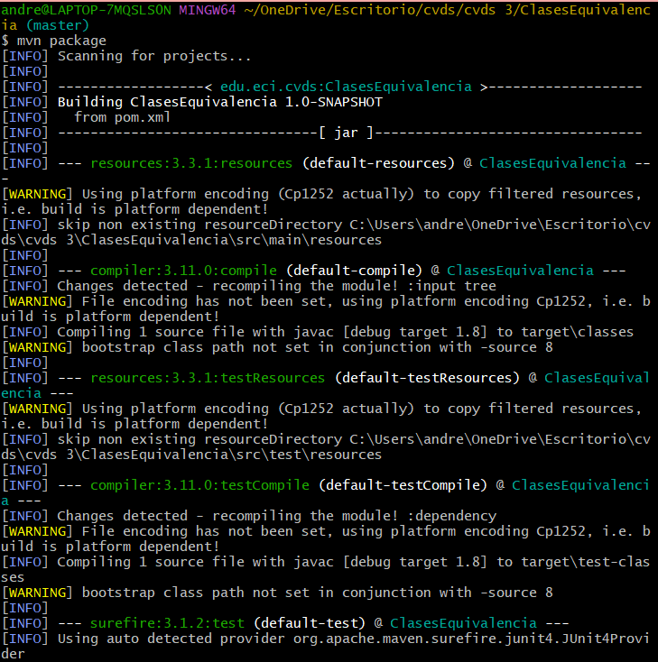
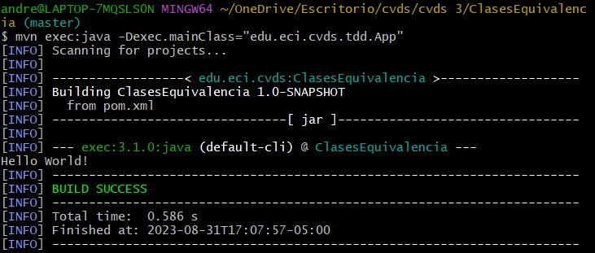
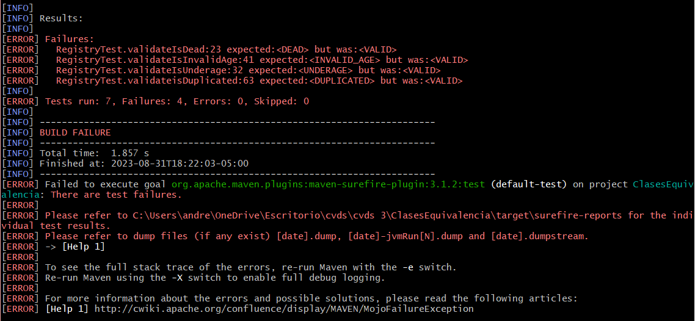
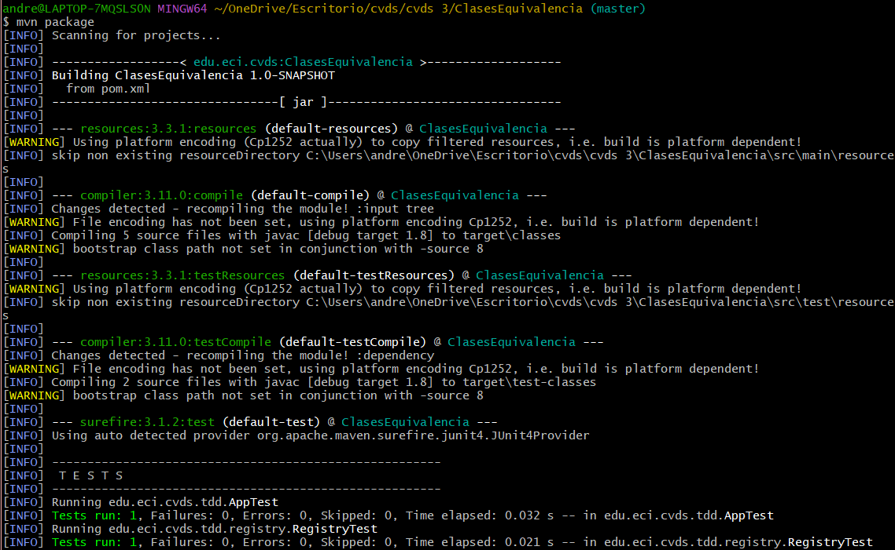
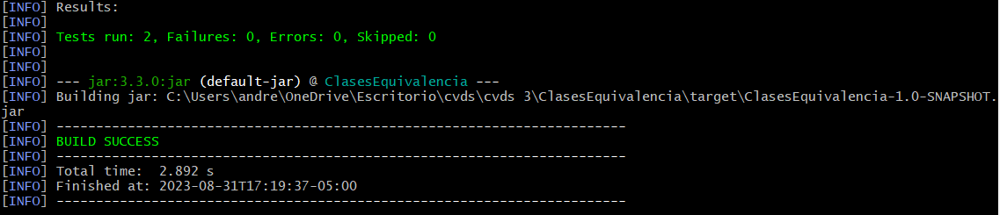
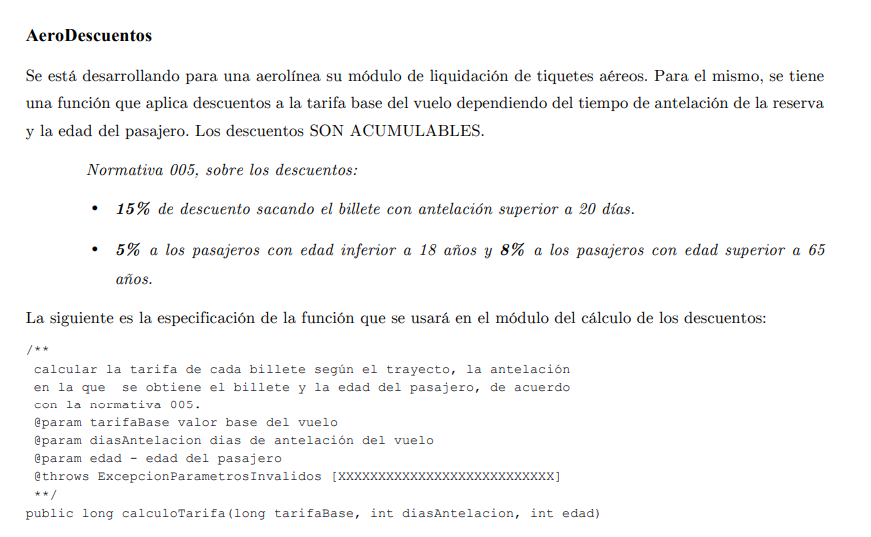
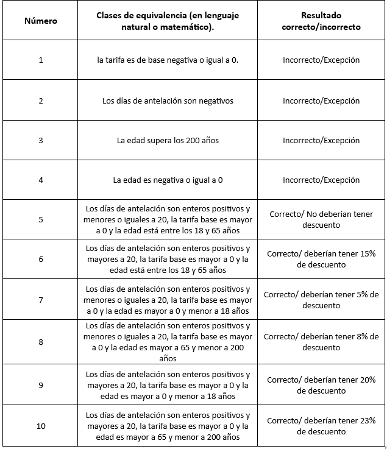
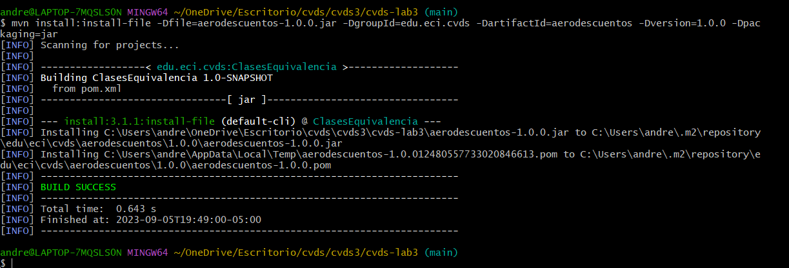
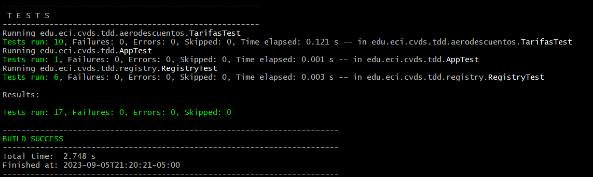

# LABORATORIO 3 - TDD
## INTEGRANTES
- Andrea Valentina Torres Tobar
- Carolina Medina Acero 


## CREAR, COMPILAR Y EJECUTAR UN PROYECTO CON MAVEN
- Ejecute los comandos necesarios de Maven, para compilar el proyecto y verificar que el proyecto se creó correctamente y los cambios realizados al archivo pom no generan inconvenientes.






## EJERCICIO “REGISTRADURÍA

### EJECUTAR LAS PRUEBAS
Piense en los casos de equivalencia que se pueden generar del ejercicio para la registraduría dadas las condiciones. Deben ser al menos 5.

Nosotras proponemos los siguientes casos: 
1. validateIsDead.
2. validateIsUnderage
3. validateIsInvalidAge
4. validateisValid
5. validateisDuplicated


### FINALIZAR EJERCICIO

Complete la implementación del método registerVoter en la clase Registry.java para retornar el resultado esperado según la entrada.





## EJERCICIO "DESCUENTO DE TARIFAS"
### REALIZAR DISEÑO DE PRUEBAS


AeroDescuentos

1. 
    deberia arrojar una excepción cuando se cumplan los siguientes casos:

        la tarifa es de base negativa o igual a 0
        Los días de antelación son negativos
        La edad supera los 200 años
        La edad es negativa o igual a 0

2. 




3.

    calculoTarifa(double tarifaBase, int edad, int diasAntelación)

        calculoTarifa(-850.000, 18, 20) = Excepción(la tarifa es de base negativa o igual a 0)
        calculoTarifa(850.000, 18, -20) = Excepción(Los días de antelación son negativos)
        calculoTarifa(850.000, 210, 20) = Excepción(La edad supera los 200 años)
        calculoTarifa(850.000, 0, 20) = Excepción(La edad es negativa o igual a 0)
        calculoTarifa(850.000, 22, 20) = Correcto/ No deberían tener descuento
        calculoTarifa(850.000, 22, 28) = Correcto/ deberían tener 15% de descuento (VALOR = 722.500)
        calculoTarifa(850.000, 15, 10) = Correcto/ deberían tener 5% de descuento (VALOR = 807.500)
        calculoTarifa(850.000, 75, 10) = Correcto/ deberían tener 8% de descuento (VALOR = 782.000)
        calculoTarifa(850.000, 14, 30) = Correcto/ deberían tener 20% de descuento (VALOR = 680.000)
        calculoTarifa(850.000, 84, 30) = Correcto/ deberían tener 23% de descuento (VALOR = 654.500)

4.

    EDAD:

    La edad es negativa o igual a 0:

        Limite superior: 0
        limite inferior: menos infinito
    
    La edad supera los 200 años:

        Limite inferior: 201
        Limite superior: infinito

    La edad esta entre 1 a 200 años:

        Limite inferior: 1
        Limite superior: 199
    
    DÍAS DE ANTELACIÓN:

    Los días de antelación son negativos O iguales a 0:

        Limite inferior: 0
        Limite superior: menos infinito
    
    TARIFA BASE:

    la tarifa es de base negativa o igual a 0:

        Limite superior: 0
        limite inferior: menos infinito


5.

     EDAD:

    La edad es negativa o igual a 0:

        Limite superior: calculoTarifa(850.000, 0, 20) = excepción
        limite inferior: calculoTarifa(850.000, -1000000000, 20)
    
    La edad supera los 200 años:

        Limite inferior: calculoTarifa(850.000, 201, 20) = excepción
        Limite superior: calculoTarifa(850.000, 10000000, 20) = excepción

    La edad esta entre 1 a 200 años:

        Limite inferior: calculoTarifa(850.000, 1, 15) = (VALOR = 807.500)
        Limite superior: calculoTarifa(850.000, 199, 15) = (VALOR = 782.000)
    
    DÍAS DE ANTELACIÓN:

    Los días de antelación son negativos O iguales a 0:

        Limite inferior: calculoTarifa(850.000, 21, 0) = excepción
        Limite superior: calculoTarifa(850.000, 21, -100000000) = excepción
    
    TARIFA BASE:

    la tarifa es de base negativa o igual a 0:

        Limite superior: calculoTarifa(0, 21, 20) = excepción
        limite inferior: calculoTarifa(-10000000000, 21, 20) = excepción

### IMPLEMENTACIÓN DE LAS PRUEBAS
Descargue el archivo aerodescuentos.jar y adicione esta nueva dependencia en el archivo pom.xml de su proyecto.

Para adicionar una librería personalizada al repositorio local de maven puede ejecutar el siguiente comando.
```sh
$ mvn install:install-file -Dfile=aerodescuentos-1.0.0.jar -DgroupId=edu.eci.cvds -DartifactId=aerodescuentos -Dversion=1.0.0 -Dpackaging=jar
```


Ejecute el comando de Maven para las fases de compilación y pruebas. Verifique el resultado exitoso de todas las pruebas y el reporte generado.



